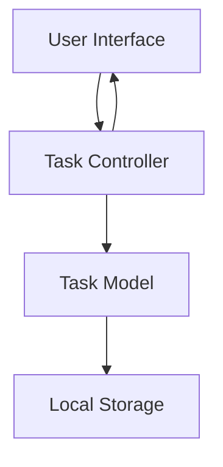

# Design Document

## Overview

The task tracker will be implemented as a simple web application with a clean, intuitive interface. The system will use local storage for data persistence and provide a responsive design that works across different screen sizes.

## Architecture

The application will follow a simple MVC (Model-View-Controller) pattern:

- **Model**: Task data structure and storage operations
- **View**: HTML/CSS interface for displaying tasks
- **Controller**: JavaScript logic for handling user interactions



## Components and Interfaces

### Task Model
- **Properties**: id, title, description, isComplete, createdAt
- **Methods**: create(), update(), delete(), getAll(), getById()

### Task Controller
- **Methods**: addTask(), toggleComplete(), deleteTask(), renderTasks()

### User Interface Components
- Task input form (title and description fields)
- Task list display
- Task item component with toggle and delete buttons
- Empty state message

## Data Models

### Task Object
```javascript
{
  id: string,           // UUID or timestamp-based ID
  title: string,        // Required, max 100 characters
  description: string,  // Optional, max 500 characters
  isComplete: boolean,  // Default false
  createdAt: Date      // Timestamp of creation
}
```

### Storage Schema
Tasks will be stored in localStorage as a JSON array under the key "tasks".

## Error Handling

- Input validation for required fields
- Graceful handling of localStorage unavailability
- User feedback for successful operations
- Confirmation dialogs for destructive actions

## Testing Strategy

- Unit tests for Task model methods
- Integration tests for controller functions
- Manual testing for UI interactions
- Cross-browser compatibility testing